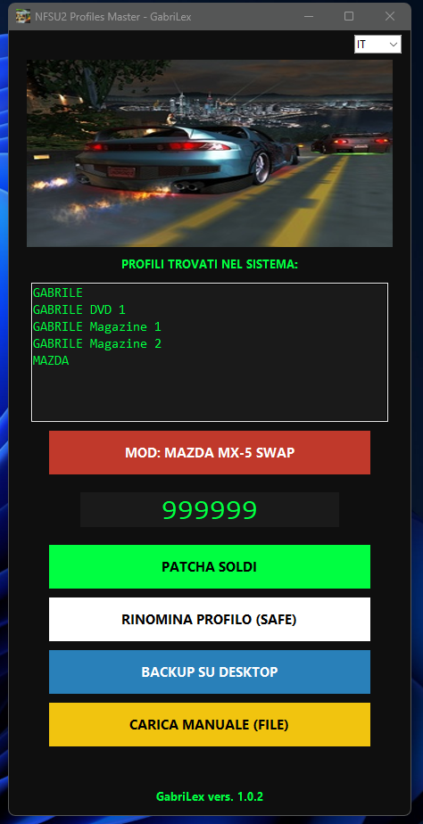
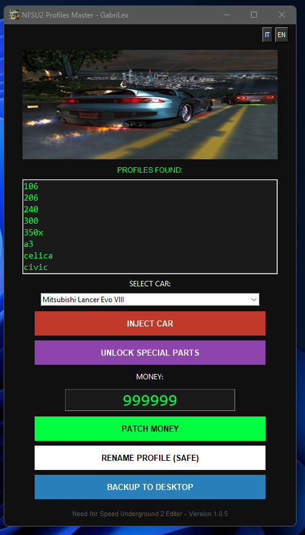

# NFSU2 Money Patcher 🏁

A lightweight, user-friendly Python utility designed to edit career money in **Need for Speed Underground 2**. It handles the technical heavy lifting like finding hidden save paths and bypassing Windows folder permissions.

## 🖼️ Screenshots

| Italian Interface | English Interface |
| :---: | :---: |
|  |  |

## ✨ Features

* **Auto-Detection**: Automatically finds save games in `%LOCALAPPDATA%`, `VirtualStore`, and common installation paths (including Steam versions).
* **Safety First**: Built-in "Extract" and "Restore" system to create backups before any modification.
* **Admin Privileges**: Automatically requests UAC elevation to ensure it can write save data in protected directories.
* **Bilingual**: Full support for both **Italian** and **English**.
* **Deep Scan**: Recursively searches for profile-specific files (save files with no extension) across multiple drives.
* **Rename Option**
* **MAZDA MX5 OVVERRIDE (SLOT 1)**

## 🛠️ How it Works

The tool modifies the save file at a specific hex offset (**41322**) where NFSU2 stores the career credit value using a little-endian 4-byte integer.

## 🚀 Installation & Usage

1.  **Requirements**:
    * Python 3.x
    * `Pillow` (for the GUI images): `pip install Pillow`

2.  **Running the script**:
    ```bash
    python nfsu2_money_patcher.py
    ```

3.  **Using the App**:
    * **Extract Saves**: Creates a folder named `ORIGINALSAVEGAMES` on your Desktop with your current files.
    * **Patch Saves**: Enter the desired amount (up to 999,999,999) and click Patch.
    * **Restore**: If something goes wrong, use this to revert to your original backups.

## 📦 Compiling to .exe

If you want to create a standalone executable for Windows, use **PyInstaller**:

```bash
pyinstaller --noconfirm --onefile --windowed --add-data "header.png;." --add-data "icona.ico;." --icon "icona.ico" --uac-admin nfsu2_profile_master.py
